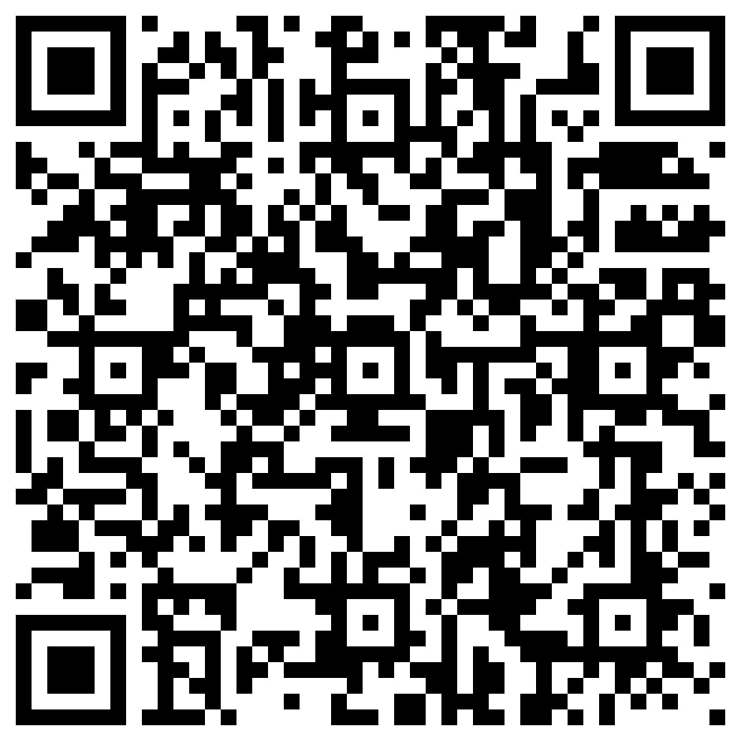
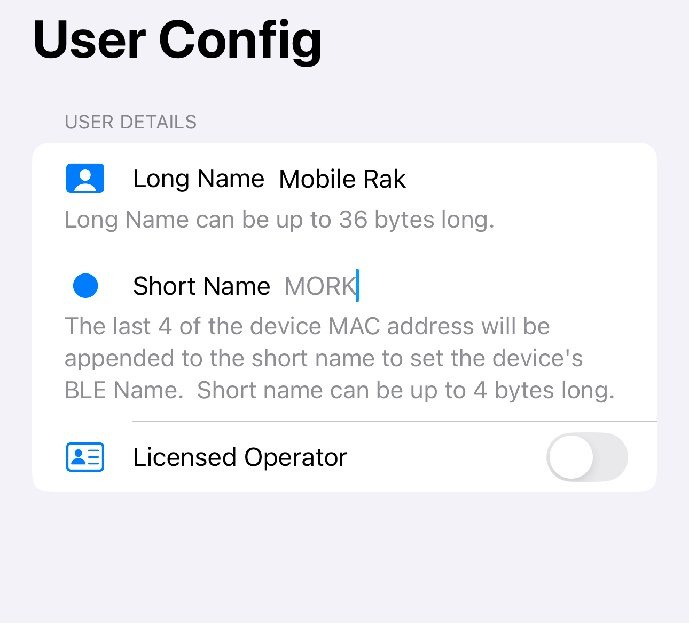

## What is Meshtastic?

Imagine a world where you can stay connected with your team, even when you're far off the grid.
That's the magic of Meshtastic—an open-source, decentralized, off-grid mesh network powered by affordable, long-range LoRa radios.

> These compact communicators form a seamless network and can link to your phone via Bluetooth or Wi-Fi.
> Meshtastic ensures you're always connected. Learn more on the official website.

## How Does It Work?

Meshtastic operates in the 915 MHz frequency range, leveraging the powerful LoRa protocol to create an interconnected web of communication.
Here's the magic behind it:

- Radios running Meshtastic software form a resilient, self-healing mesh network.
- Connect to these devices via Bluetooth for nearby use or through handheld nodes that double as repeaters.
- Messages effortlessly hop from node to node, extending your reach and building a robust communication chain.

## Getting Started with Meshtastic

Ready to join the Meshtastic revolution?
Here's how:

1. Choose Your Device

- Heltec Boards: Budget-friendly and beginner-friendly.
- LilyGo & Wisblock Rak Boards: Advanced boards offering maximum flexibility for customization.

2. Flash the Firmware

After selecting your device, use the [Meshtastic web flasher](https://flasher.meshtastic.org/) to install the software.
It's quick, straightforward, and backed by excellent documentation.

3. Customize with 3D Cases

If you have access to a 3D printer, explore these amazing cases:

- Heltec V3 Mini Case
- RAK19007/RAK5005 Case
- T-Beam V1.x Case
- T-Beam Supreme Case

4. Set your Lora Region to United States

In most cases where we are located in Iowa we'll need to use the 915 mhz bands of LoRa

If you plan on participating in the meshmap you'll need to turn on Ok to MQTT.
More information [here](https://meshtastic.org/docs/configuration/radio/lora/#ignore-mqtt).

5. Set your hop count.

Current in Iowa it's a bit sparse for coverage.
It might be worth turning up for the recommended 3 hops

Information on [Meshtastic's docs](https://meshtastic.org/docs/configuration/radio/lora/#max-hops).

6. Add Channels for Private configuration

Use These QR Codes to Add the additional IROMesh Channel to your node.
The Public Channel is available to everyone, but the IROMesh Channel will give us a little better place to communicate among the group.

7. Name Your Device

Be Found Easily by naming your device! If you are already a licensed Amateur Radio Operator you can opt to put in your call sign

## Tips and Tricks

### Operating Modes

Meshtastic supports various operating modes to suit different needs:

| Device Role | Description | Best Uses |
|-------------|-------------|-----------|
| CLIENT | App connected or stand alone messaging device. Rebroadcasts packets when no other node has done so. | General use for individuals needing to communicate over the Meshtastic network with support for client applications. |
| CLIENT_MUTE | Device that does not forward packets from other devices. | Situations where a device needs to participate in the network without assisting in packet routing, reducing network load. |
| CLIENT_HIDDEN | Device that only broadcasts as needed for stealth or power savings. | Use in stealth/hidden deployments or to reduce airtime/power consumption while still participating in the network. |
| TRACKER | Broadcasts GPS position packets as priority. | Tracking the location of individuals or assets, especially in scenarios where timely and efficient location updates are critical. |
| LOST_AND_FOUND | Broadcasts location as message to default channel regularly for to assist with device recovery. | Used for recovery efforts of a lost device. |
| SENSOR | Broadcasts telemetry packets as priority. | Deploying in scenarios where gathering environmental or other sensor data is crucial, with efficient power usage and frequent updates. |
| TAK | Optimized for ATAK system communication, reduces routine broadcasts. | Integration with ATAK systems (via the Meshtastic ATAK Plugin) for communication in tactical or coordinated operations. |
| TAK_TRACKER | Enables automatic TAK PLI broadcasts and reduces routine broadcasts. | Standalone PLI integration with ATAK systems for communication in tactical or coordinated operations. |
| REPEATER | Infrastructure node for extending network coverage by always rebroadcasting packets once with minimal overhead. Not visible in Nodes list. | Best positioned in strategic locations to maximize the network's overall coverage. Device is not shown in topology. |
| ROUTER | Infrastructure node for extending network coverage by always rebroadcasting packets once. Visible in Nodes list. | Best positioned in strategic locations to maximize the network's overall coverage. Device is shown in topology. |
| ROUTER_LATE | Infrastructure node that always rebroadcasts packets once but only after all other nodes, ensuring additional coverage for local clusters. Visible in Nodes list. | Ideal for covering dead spots or ensuring reliability for a cluster of nodes where placement doesn't benefit the broader mesh. Device is shown in topology. |

For more details, explore the [Meshtastic Blog](https://meshtastic.org/blog/choosing-the-right-device-role/).

Here is another great video by TheCommsChannel explaining [Different Roles](https://youtu.be/htjwtnjQkkE?si=T3gjdGik5H1nYJo4).

In the best case or you are in doubt choose client. If you have a mobile unit or traveling by plane client_mute is super helpful

## Join the Community

Have questions or want to connect? Find us on [Discord](https://discord.gg/jHBywwPJD8) and join the conversation with Iowa Radio Operators!
